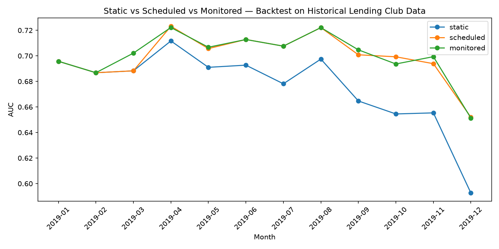
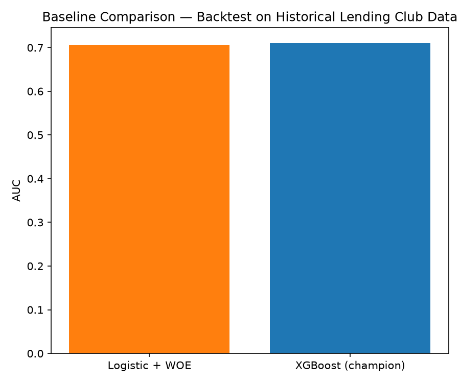
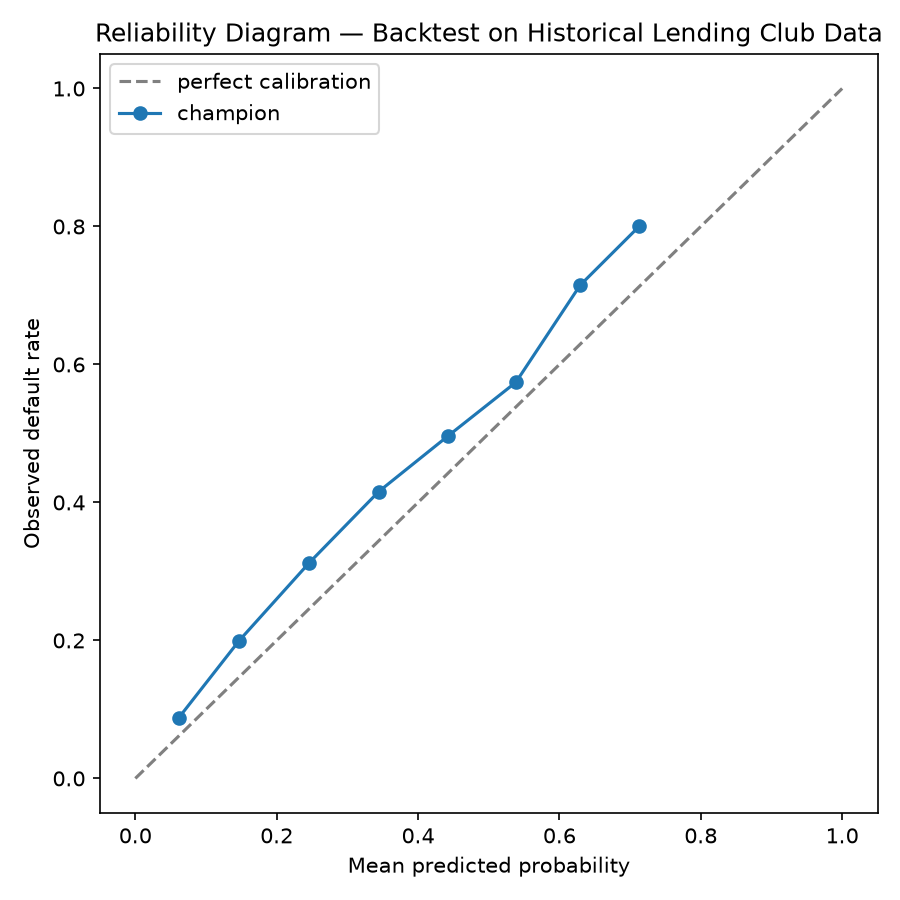
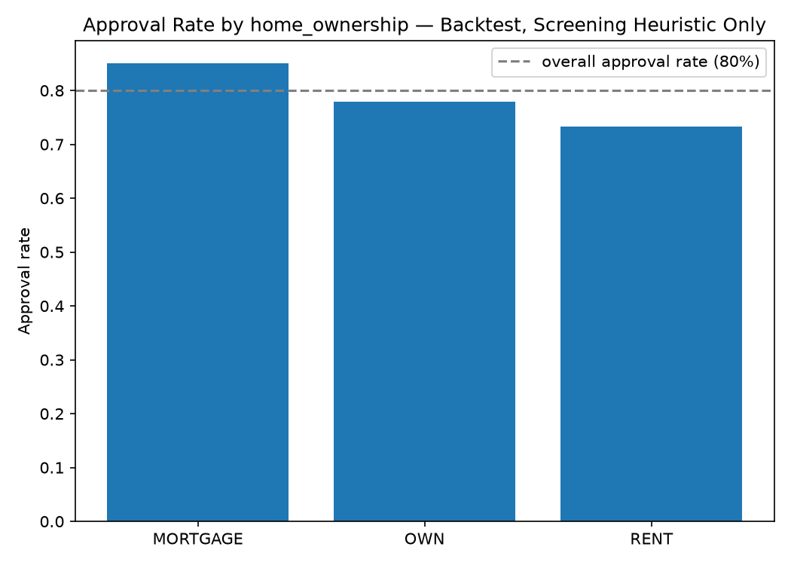
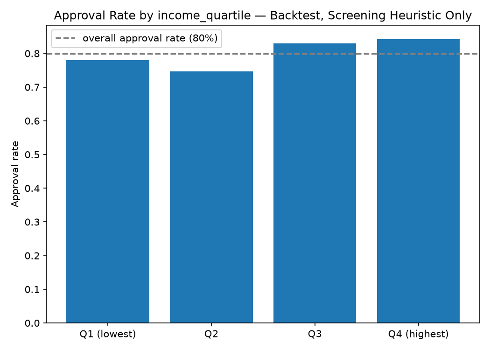
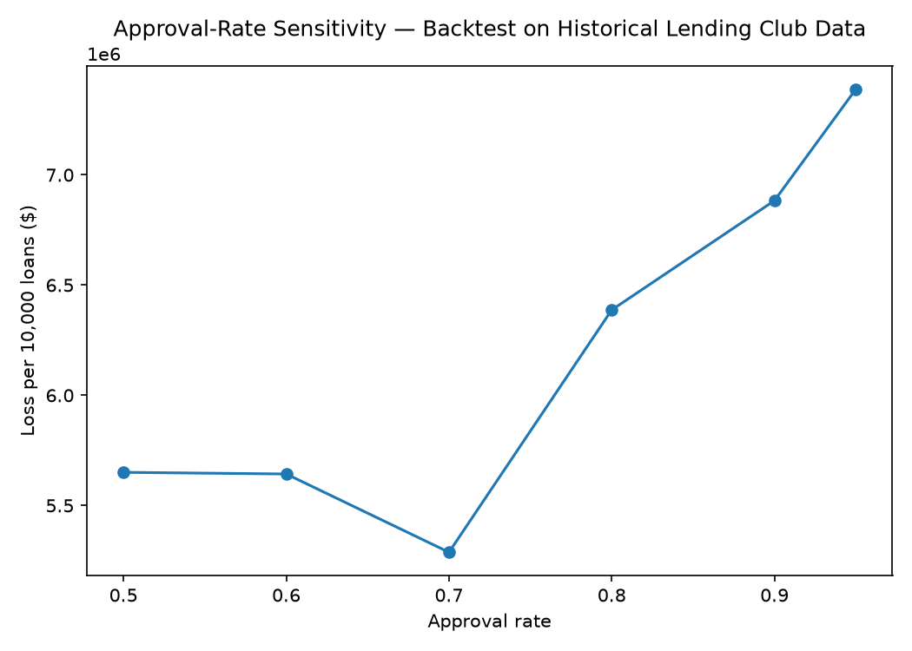

# CreditPulse — Agentic MLOps Control Plane for Credit Risk Models

> **Everything in this project is a backtest on public historical Lending Club data.**
> Nothing here runs against live loans, a real bank, or real money. Every quantified result
> below is labeled "backtest" and should be read as a simulation, not a production outcome.

## What this is

Credit-risk models degrade silently in production when the economic regime shifts underneath
them — a model trained before 2019 kept scoring loan applications confidently well into the
2020 COVID shock, even as borrower behavior changed faster than the model could be retrained.
CreditPulse is an agentic MLOps system that trains a real credit-default model on real
historical loan data, detects when it has drifted, retrains and evaluates a challenger under
human-gated promotion, and exposes the entire lifecycle as MCP tools so an LLM agent can
operate the model conversationally.

## Architecture

```
Loan applications (2007-2020, walked forward)
        │
        ▼
Champion model (XGBoost, trained on pre-2019 data)
        │ features + prediction
        ▼
Drift engine — PSI/KS statistics + PyTorch autoencoder reconstruction error
        │ threshold breach
        ▼
Retrain + shadow-evaluate challenger (MLflow tracks both runs)
        │
        ▼
MCP server (6 tools) ── driven by Claude Desktop, Claude Code, or any MCP client
```

## What's built (Phases 1-7)

- **Phase 1 — Data + baseline model.** 2,925,493 Lending Club loans (2007-2020), a leak-safe
  temporal split (train on loans issued before 2019, evaluate on 2019-2020), and an XGBoost
  champion. Held-out pre-2019 AUC: **0.7102**. Quarterly AUC on 2019-2020 shows a real decline
  (0.691 → 0.642) through the reliably-labeled window — see [`reports/phase1_auc_decline.png`](reports/phase1_auc_decline.png).
- **Phase 2 — Drift engine.** PSI/KS statistical drift plus a PyTorch autoencoder's
  reconstruction-error signal, combined into a single `ok`/`warning`/`breach` report with
  per-feature attribution. Macro-feature drift (income, DTI, utilization, FICO) breaches
  starting June 2019 — **17.4 weeks of lead time** ahead of the AUC trough — separated from a
  Lending Club grading-methodology shift that breaches even earlier (March 2019) but reflects
  a platform change, not economic drift. See [`reports/phase2_drift_lead_time.png`](reports/phase2_drift_lead_time.png).
- **Phase 3 — Retrain + MLflow registry.** A challenger retrained on a trailing 12-month
  window beats the champion on AUC, F1, and Brier score (0.6308 → 0.6803 AUC) on a held-out
  slice neither model trained on. `promote_challenger`/`rollback` are gated behind an
  identity-checked `confirm=True` — verified by a passing test
  ([`tests/test_lifecycle_gating.py`](tests/test_lifecycle_gating.py)) that no silent
  auto-promotion is possible.
- **Phase 4 — MCP server.** All six lifecycle tools (`get_model_health`, `get_drift_report`,
  `trigger_retrain`, `promote_challenger`, `rollback`, `explain_prediction`) exposed via the
  `mcp` SDK, driven end-to-end by a real MCP client below.
- **Phase 5 — Quantified backtest.** A monthly walk-forward comparing three strategies —
  static (never retrains), scheduled (blind quarterly retrain), and monitored
  (drift-triggered retrain) — through the reliably-labeled 2019 window, plus a transparent
  dollar-impact estimate. See the [Phase 5 results](#phase-5--quantified-backtest-results)
  section below.
- **Phase 6 — Model selection.** Optuna hyperparameter tuning (kept the hand-picked
  defaults — tuning found only a +0.003 AUC improvement, below the adoption threshold), a
  hand-rolled logistic regression + WOE scorecard baseline (0.7060 AUC, close behind
  XGBoost's 0.7102), and a calibration check that found the champion systematically
  underestimates default risk. See the
  [Phase 6 results](#phase-6--model-selection) section below.
- **Phase 7 — Fairness & sensitivity.** A disparate-impact screen (4/5ths rule) across
  `home_ownership` and income-quartile proxies — explicitly caveated, since Lending Club's
  public data has no protected-class labels — finds neither flagged (ratios 0.863, 0.887).
  An approval-rate sensitivity sweep replaces Phase 5's single 80%-only dollar estimate with
  a full curve. See the
  [Phase 7 results](#phase-7--fairness--sensitivity) section below.

## Bugs Found and Fixed

This project was built by an AI coding agent (Claude) working through each phase, actually
running every script against real data rather than trusting the code to be correct on
inspection. That discipline surfaced real bugs — methodology mistakes as much as software
ones — at almost every phase. They're documented here rather than buried in commit history
because *how* they were found and fixed is the more interesting part of this project than
any individual chart.

**Silent data and methodology bugs** — the kind that don't crash, they just produce a
plausible-looking wrong answer:

- **The eval window was empty and nothing errored.** The first Kaggle mirror downloaded
  (`wordsforthewise/lending-club`) only covers loans through Q4 2018 — the entire 2019-2020
  drift window the whole project depends on had zero rows. Caught only because the data
  pipeline was run against the real file and its row counts inspected, not assumed. Fixed by
  switching to a mirror (`ethon0426/lending-club-20072020q1`) that actually extends through
  2020.
- **AUC of 0.32 in the last quarter — worse than random.** The naive read is "the model
  degraded catastrophically." The actual cause: loans issued close to the dataset's cutoff
  haven't had enough time to resolve to "Charged Off" yet, so the default rate in that
  quarter was 0.2%, not the model's fault. Fixed by defining a reliability threshold (≥100
  observed defaults) and excluding quarters that don't meet it — a real censoring problem
  that then had to be re-solved for the eval window, the MCP server's health check, the
  backtest, and the fairness screen, since every later phase reused the eval data.
- **The drift engine looked broken — breaching from the very first month.** Per-feature
  attribution revealed it wasn't a bug: Lending Club changed its own loan-grading
  methodology in March 2019, months before any macroeconomic drift. Separating that
  platform-driven signal from genuine economic drift (which started in June 2019) turned an
  apparently-broken result into the project's most interesting finding.
- **`trigger_retrain` silently promoted a worse model.** Its default retrain-as-of date
  landed the evaluation slice inside the same label-censoring window described above,
  making a genuinely worse challenger (AUC 0.196) look statistically comparable to the
  champion (AUC 0.322) — and the confirm-gate, working exactly as designed, still approved
  it, because gating checks *whether a human said yes*, not *whether the underlying numbers
  are trustworthy*. Caught by reading the actual walkthrough transcript before believing it.
- **A stale preprocessor after promotion.** The MCP server's `get_drift_report` transformed
  new data through whichever pipeline was *currently* champion, but compared it against a
  drift reference frozen in the *original* champion's feature space. Confirmed with a
  regression test that reverts the fix and reproduces the exact crash
  (`RuntimeError: mat1 and mat2 shapes cannot be multiplied (11x16 and 39x16)`) before
  trusting the fix mattered.

**Environment and tooling bugs** — real, but not obvious from reading the code:

- **A dependency resolver picked a 2021-era package for no reason.** `uv`'s resolver
  occasionally locked `shap` to a `numba`/`llvmlite` pair that only supports Python <3.10,
  on a project pinned to 3.12 — a stale-cache resolution artifact, fixed with explicit
  version floors.
- **XGBoost + PyTorch crash when run in the same process on macOS.** Both bundle their own
  OpenMP runtime; running both without `OMP_NUM_THREADS=1` segfaults. This one had to be
  learned twice — once inside the drift engine, and again inside the MCP server subprocess,
  where the guard was one import too late (the server's own earlier imports had already
  pulled in the conflicting libraries before the fix could take effect).
- **The same fix, applied where it wasn't needed, cost 25 minutes.** A later report script
  copy-pasted the OpenMP guard defensively — but that script never imports `torch` at all,
  so the guard just forced 30 rounds of hyperparameter search to run single-threaded for no
  reason. Caught by noticing the process's actual CPU usage didn't match a healthy
  multi-threaded run, not by it crashing.
- **An MCP SDK renamed its main class between versions.** The installed SDK's `FastMCP` is
  now `MCPServer`. Verified the real, installed API by inspecting it directly before writing
  any server code, rather than trusting the spec's (now-outdated) naming.

**Quiet correctness bugs in the test suite itself:**

- **Monkeypatching a function that was already imported by value.** A test patched
  `mcp_server.state.get_state`, but the module under test had done
  `from mcp_server.state import get_state`, binding its own independent reference — the
  patch silently did nothing, and four tests ran against the real 1.78M-row dataset instead
  of a fast synthetic fixture. The tell was a 29-second test run where every other test
  file finishes in under a second.
- **`numpy.bool_` is not `bool`.** A fairness check's `ratio < threshold` returned
  `np.True_`, which fails an `is True` identity comparison even though it's equal to `True`
  — a real footgun in any codebase mixing numpy arithmetic with plain Python assertions.

## How to run

```bash
uv sync
uv run python -m data.prepare              # downloads nothing — expects the raw CSV locally
uv run python -m reports.generate_phase1_report
uv run python -m reports.generate_phase2_report
uv run python -m reports.generate_phase3_report
uv run python scripts/run_mcp_walkthrough.py   # drives the MCP server via a real client
uv run python -m backtest.run_backtest         # the final quantified backtest
uv run python -m reports.generate_phase6_report # hyperparameter tuning (~15-30 min), baseline, calibration
uv run python -m reports.generate_phase7_report # fairness screen + approval-rate sensitivity
```

## MCP Lifecycle Walkthrough

The transcript below was captured by running [`scripts/run_mcp_walkthrough.py`](scripts/run_mcp_walkthrough.py)
against the real [`mcp_server/server.py`](mcp_server/server.py) as a subprocess, connected
over stdio via the official `mcp` Python SDK's client (`stdio_client` + `ClientSession`) —
not a mock. Routine MLflow dependency-export logging noise has been trimmed for readability;
every tool result and the confirm-gating behavior are shown exactly as produced. Every number
is a backtest computation over historical Lending Club data.

```
Connected. Available tools: ['get_model_health', 'get_drift_report', 'explain_prediction',
'trigger_retrain', 'promote_challenger', 'rollback']

--- get_model_health() ---
{
  "champion_version": "1",
  "days_since_last_retrain": 0.2,
  "recent_batch_auc": 0.5926339735884674,
  "recent_batch_f1": 0.013157894736842105,
  "recent_batch_label": "2019-12",
  "drift_status": "breach"
}

--- get_drift_report(window="2019-06") ---
{
  "window": "2019-06",
  "status": "breach",
  "autoencoder_status": "ok",
  "autoencoder_fraction_above_threshold": 0.017767295597484276,
  "statistical_status": "breach",
  "top_drifting_features": [
    { "feature": "grade", "type": "categorical", "psi": 0.6306990618105149, "ks_stat": null },
    { "feature": "sub_grade", "type": "categorical", "psi": 0.5231292120839162, "ks_stat": null },
    { "feature": "revol_util", "type": "numeric", "psi": 0.2510489596788549, "ks_stat": 0.21774325148894297 },
    { "feature": "fico_range_low", "type": "numeric", "psi": 0.1699795940329936, "ks_stat": 0.17182386473008981 },
    { "feature": "fico_range_high", "type": "numeric", "psi": 0.1699795940329936, "ks_stat": 0.17182386473008981 }
  ]
}

--- trigger_retrain() ---
{
  "training_window_start": "2018-11-01",
  "training_window_end": "2019-10-01",
  "holdout_window_start": "2019-11-01",
  "holdout_window_end": "2020-01-01",
  "champion_auc": 0.6308324854701808,
  "challenger_auc": 0.6803063457330416,
  "champion_f1": 0.015503875968992248,
  "challenger_f1": 0.06042296072507553,
  "champion_brier": 0.08494247496128082,
  "challenger_brier": 0.07829736173152924,
  "challenger_wins": true,
  "challenger_version": "2"
}

--- promote_challenger(confirm=False) — expected refusal ---
Error executing tool promote_challenger

Challenger (AUC 0.6803) beat champion (AUC 0.6308) — proceeding to promote.

--- promote_challenger(confirm=True) ---
{
  "new_champion_version": "2"
}
```

The client-visible error message above ("Error executing tool promote_challenger") is
generic, but the server process's own stderr for that same call shows exactly why it
refused:

```
lifecycle.registry.ConfirmationRequired: promote_challenger requires confirm=True
```

This is the full spec lifecycle: health check → drift report → retrain → review the
comparison → promote with explicit confirmation. `promote_challenger(confirm=False)` was
attempted first and genuinely refused by the server before `confirm=True` was ever sent.

## Phase 5 — Quantified Backtest Results

All figures below are a **backtest on public historical Lending Club data** — a simulation
of what three retraining strategies would have achieved, not a live production outcome.

**Window.** The walk-forward is restricted to the reliably-labeled window, **2019-01 through
2019-12** — 12 calendar months, each with at least 100 observed defaults (the same
reliability bar Phase 1 established). Months closer to the eval data's September 2020 cutoff
are right-censored: loans issued that recently haven't had time to actually resolve, which
would make both the AUC trajectory and the dollar-impact calculation meaningless for that
period regardless of which strategy is actually better — so the walk stops before entering
that region, rather than reporting numbers known to be unreliable.



| Arm | Mean AUC (Jan-Dec 2019) | Retrains | AUC points recovered vs static |
|---|---|---|---|
| Static (never retrains) | 0.6758 | 0 | — |
| Scheduled (blind quarterly) | 0.6990 | 3 | +0.0233 |
| Monitored (drift-triggered, 2-month cooldown) | 0.7004 | 5 | +0.0247 |

**Drift-detection lead time** (from Phase 2, reused here — not recomputed): macro-feature
drift breached **17.4 weeks** before the AUC trough, giving the monitored strategy a genuine
early-warning window rather than reacting only after damage was already visible in AUC.

**Dollar impact.** At the final reliable month (2019-12), with a fixed 80% approval rate
(each model picks its own threshold to accept exactly the lowest-risk 80% of that month's
applicants — this is what keeps the comparison fair, since a model can't "win" simply by
rejecting more loans than its competitor) and loss given default simplified to the full
loan principal (no partial-recovery modeling — recovery amounts are excluded from features
as leaky post-origination fields, spec §3, and genuinely aren't available here either):

| Arm | Loans accepted | Defaults | Default rate | Loss per 10,000 loans |
|---|---|---|---|---|
| Static | 1,845 | 79 | 4.28% | $6,387,127 |
| Monitored | 1,845 | 73 | 3.96% | $5,092,141 |

Both arms accept the **same number of loans** — the comparison isn't inflated by one model
simply rejecting more applicants. The monitored strategy's lower default rate among an
equally-sized accepted pool translates to an estimated **$1,294,986 saved per 10,000 loans**
from monitoring + retraining versus never retraining, on this backtest.

## Phase 6 — Model Selection

All figures below are a **backtest on public historical Lending Club data**.

**Hyperparameter tuning.** A 30-trial Optuna search (bounded, not exhaustive) over
`n_estimators`, `max_depth`, `learning_rate`, `subsample`, `colsample_bytree`, and
`min_child_weight`, maximizing AUC on the same chronological-last-10% holdout every other
phase uses. Best tuned holdout AUC: **0.7132**, versus the hand-picked default's **0.7102**
— a **+0.0030** improvement, below the 0.005 threshold set for adopting a new
configuration. **Decision: the current default configuration is kept.** Tuning confirmed the
original hand-picked hyperparameters were already close to optimal for this problem, rather
than finding a meaningfully better one — a legitimate outcome, not a failed search.

**Baseline comparison.** A hand-rolled logistic regression + Weight-of-Evidence scorecard —
the industry-standard interpretable credit model — scores **0.7060** AUC on the same
held-out slice, against the XGBoost champion's **0.7102**. The two are close (≈0.004 AUC
apart):



This is a genuinely useful finding, not just a formality: in a regulated setting where every
score needs to be explainable as adverse-action reasons, a WOE scorecard whose coefficients
are directly interpretable as points added or subtracted may be worth a ~0.4-point AUC
cost. XGBoost's edge here is real but modest, and its explainability depends on SHAP
(`explain_prediction`, Phase 4) rather than being intrinsic to the model.

**Calibration.** Expected Calibration Error: **0.0505**. The reliability diagram shows a
consistent pattern, not noise — every single probability bucket sits above the perfect-
calibration line, and the gap widens at higher predicted risk (bucket predicting 0.63 default
probability observes 0.71; bucket predicting 0.71 observes 0.80):



**Read honestly: the champion systematically underestimates default risk, most severely for
already-risky loans.** Raw `predict_proba` output should not be used directly for pricing
without a calibration correction (e.g., Platt scaling or isotonic regression) — this backtest
did not build one, since Phase 6's goal was to measure calibration, not fix it, but the
finding is real and would need addressing before any pricing use.

## Phase 7 — Fairness & Sensitivity

All figures below are a **backtest on public historical Lending Club data**.

> **Limitation, stated plainly:** Lending Club's public dataset contains no protected-class
> labels (race, sex, age, national origin, marital status) — genuine fair-lending analysis is
> not possible on this data. The check below uses two literature-grounded **proxies**
> instead — `home_ownership` and income quartiles of `annual_inc` — and its results are a
> **screening heuristic, not a legal or regulatory determination**.

**Disparate-impact screen**, evaluated on 2019-12 (2,307 loans) at the project's standard
80% approval rate, using the standard US "4/5ths rule" (flagged if the ratio of the
lowest-approval-rate group to the highest falls below 0.8):

| Proxy | Lowest approval rate | Highest approval rate | Ratio | Result |
|---|---|---|---|---|
| `home_ownership` | RENT: 73.3% | MORTGAGE: 85.0% | 0.863 | not flagged |
| `income_quartile` | Q2: 74.7% | Q4 (highest): 84.2% | 0.887 | not flagged |




Neither proxy is flagged under the 4/5ths rule. Worth noting honestly rather than glossing
over: within `home_ownership`, the `OWN` group has both a *higher* approval rate (77.9%) and
a *higher* realized default rate among its approved loans (7.5%, versus RENT's 5.2%) than
RENT — an inconsistency plausibly explained by `OWN` being the smallest group here (290
loans total) rather than a systematic pattern; a single month's data isn't enough to
distinguish real effect from sampling noise, and this screen should be re-run across more
months before drawing a firm conclusion either way.

**Approval-rate sensitivity**, replacing Phase 5's single 80%-only dollar estimate with a
full curve:



Loss per 10,000 loans rises from roughly $5.3M-$5.7M at conservative approval rates
(50-70%) to $7.4M at 95% — the expected direction, since approving more applicants means
accepting progressively riskier ones. The curve isn't perfectly monotonic (a slight dip at
60-70% before the steeper rise) — with roughly 2,300 loans in a single evaluation month,
that's consistent with sampling noise rather than a real effect, and is reported as-is
rather than smoothed over.

## Definition of Done

Reproduced from the spec, checked only where a specific report, chart, or test in this repo
verifies the claim:

- [x] Baseline model shows a real, visible AUC decline through 2020 without retraining —
      [`reports/phase1_auc_decline.png`](reports/phase1_auc_decline.png), 0.691 → 0.642 over
      the reliably-labeled 2019 quarters.
- [x] Drift engine fires before the AUC trough, with a measured lead time —
      [`reports/phase2_drift_lead_time.png`](reports/phase2_drift_lead_time.png), 17.4 weeks
      (macro-feature signal).
- [x] Retrain/evaluate/promote pipeline works end-to-end, tracked in MLflow —
      [`reports/generate_phase3_report.py`](reports/generate_phase3_report.py) output;
      registry backed by `var/mlflow.db`.
- [x] `promote_challenger`/`rollback` verifiably refuse to act without `confirm=True`,
      covered by a passing test —
      [`tests/test_lifecycle_gating.py`](tests/test_lifecycle_gating.py).
- [x] All six MCP tools work when driven from a real MCP client, with a saved example
      transcript — [MCP Lifecycle Walkthrough](#mcp-lifecycle-walkthrough) above, captured by
      [`scripts/run_mcp_walkthrough.py`](scripts/run_mcp_walkthrough.py).
- [x] Backtest produces the four quantified numbers (AUC trajectory, lead time, AUC points
      recovered, $-per-10,000-loans), each clearly labeled as simulated/historical — this
      section, backed by [`backtest/run_backtest.py`](backtest/run_backtest.py).
- [x] README states plainly, near the top, that this is a backtest on public historical data
      and not a live production deployment — see the callout at the top of this file.

## Non-negotiable framing

- `promote_challenger` and `rollback` require `confirm: bool` to be exactly `True` — not
  merely truthy. `1`, `"true"`, and `"yes"` are all refused. This is enforced in
  [`lifecycle/registry.py`](lifecycle/registry.py) and covered by a passing test, not just
  documentation.
- Dollar-impact and lead-time figures are computed transparently from the dataset's own
  values, with the calculation shown in each report script — never a single unexplained
  headline number.
